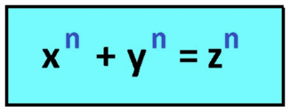
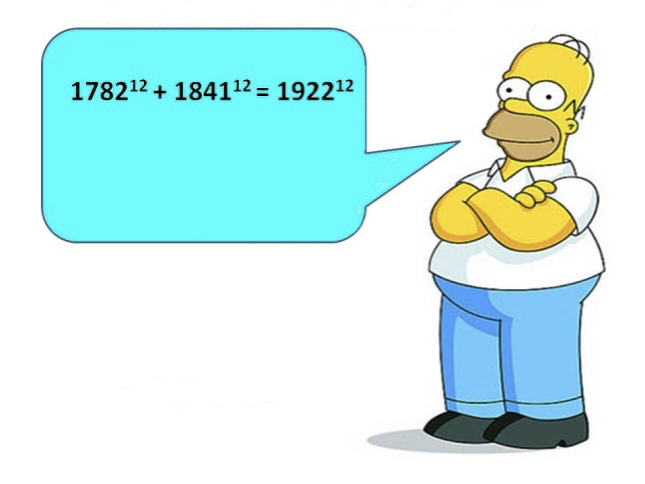

# ➗ Fermat's Theorem And More Than Three Centuries Of History

In 1607, an illustrious jurist and mathematician named Pierre de Fermat was born
in Beaumont de Lomagne (France).

Eric Temple Bell, a Scottish-born mathematics historian, dubbed Fermat "Prince
of the amateurs."


Fermat was educated at the University of Orleans and made great contributions in
the field of mathematics. One of the most famous tells the story is that the
mathematical genius had in his possession a bilingual edition of the book
"Arithmetica de Diofanto" (Latin and Greek), on whose pages and apart from each
problem, Fermat wrote comments or more good math puzzles.

In the course of time, each of these riddles have been solved by personalities
such as Newton, Leibniz, etc. but one of them remained unsolved and is the one
that was written, around the content embodied in problem VIII.

Fermat's note stated: “It is impossible to find a way to convert a cube into the
sum of two cubes, a fourth power into the sum of two fourth powers, or in
general any power beyond the square, into the sum of two powers. of the same
class ... "He also completed it with the following sentence:" ... I have
discovered for the fact an excellent demonstration. But this margin is too small
to fit in it."


This puzzle was about the result of a number to "n" NO SE DICE ASI, as the
addition of two numbers raised to "n". In summary, what Fermat affirmed was that
since “n” is an integer equal to or greater than 3, there would be no positive
integers in this formula, where “x”, “y” and “z” fulfill this equality:



Nowadays, a large part of us and at some point in our lives, have used the
Pythagorean Theorem, that famous formula that relates the length of the
hypotenuse with that of the legs in a right triangle and where Fermat's Theorem
is applied for n = 2.


It is no secret to anyone that this equality is al reves, is equally true for all
possible combinations and different numbers. But if we go further and ask
ourselves what happens when n = 3? Will there be a numerical combination that by
raising two numbers to the cube to the third power and adding them, we will
obtain the cube of a third number as a result?

Suppose for a moment that we manage to demonstrate the above. What will happen
to exponents greater than 3?

On the other hand, this annotation by Fermat was kept anonymous? for a long time
and a great number of leading mathematicians have tried to solve this theorem
without success. Reasons why, a lot of intrigue was generated around this riddle
and for more than three centuries it was a true mystery.

## GREAT MATHEMATICS PROVEN FERMAT'S THEOREM FOR SOME CASES

The first to make progress in this regard was Fermat himself, who managed to
show that his theorem did work for the case n = 4 and for this, he used a
certain variant of the principle of induction with the infinite descent
technique.

Another important mathematician who made a great contribution was Leonhard Euler
when he was able to prove Fermat's Theorem for the case n = 3, although it is
true that an error was later found in this proof. Other contributions
pre-established by Euler himself, allowed to find the correct solution and that
is why, it was considered in mathematical circles, that Euler had proved the
theorem for this case.

Even by this failed proof, the certainty arose that some complex numbers behave
differently from integers.

### Sophie Germain

The next step was taken by mathematician Sophie Germain. Where she established
Fermat's conjecture for a specific case that expresses: If “p” and also “2p + 1”
are both prime numbers. The Fermat expression determined for a power "p" would
be fulfilled when none of the "x", "y" or "z" were divisible by "p".

Sophie Germain managed to prove the conjecture for every number "p" less than
100 and another mathematician named Adrien Marie Legendre, proved this case for
all numbers less than 197.

But in 1825 it was when Legendre together with Peter Gustav, were able to
generalize the proof from Euler, only for the case n = 5. Later Lamé manages to
prove the theorem in 1839 for when n = 7.

Many years later (1955), two Japanese mathematicians argued that all elliptical
curves, although they were of different shapes, could be considered as
camouflaged modular shapesm?. They were called: Goro Shimura and Yutaka
Tamiyama.

But they ran into the problem that to confirm or disprove this conjecture, there
are an infinite number of different elliptic curves, so proving that every
possible elliptical curve has a similarity to some modular shape was simply an
impossible task.

It was not until 1982 when a mathematician named Gerhard Frey came up with the
idea of ​​comparing elliptic curves as a solution to Fermat's Theorem, by means
of the following formula:

```
y ^ 2 y2?= x (x-ap) (x + bp)
```

However, in theory, this elliptical curve did not have an associated modular
shape and therefore, only one of the two conjectures could be true, since they
contradicted each other. So if there was an elliptical curve that corresponded
to Fermat's Theorem, we could assume that all elliptic curves would not
necessarily have an associated modular shape.

Discovering which of the two propositions was the correct one would indirectly
lead to solving whether Fermat's Theorem was true or not, since if a way was
found to know if for each possible elliptic curve there was an associated
modular form, as had been proposed by the Japanese Tamiyama and Shimura. There
would then be no elliptical curve that would correspond to Fermat's Theorem.

### Andrew Wiles

This mathematician born in 1953, encountered Fermat's Theorem for the first time
at the age of 10, in a book that dealt with this dilemma, in a bookstore that
was on the way home from school. The theorem shocked him since despite its
simplicity, even he could understand it at such a young age, but at the same
time it was so complex that no one had been able to solve it three centuries
after its promulgation. Even a large number of illustrious mathematicians
claimed that it could not be solved.

At that time, Wiles had full knowledge that his mathematical abilities and
skills were not enough to try to solve the riddle, so he forgot it to return to
it in 1986.


Credit: Charles Rex Arbogast / AP

Andrew believed that the secret to solving this conjecture was in geometry and
specifically in achieving a mathematical representation of all elliptic curves.
In addition to comparing them with their associated modular forms, but he also
knew that these are abstract and symmetric functions, found in the plane that
represents imaginary numbers.

Following his belief, Wiles developed a mathematical method that allowed him to
compare each of the infinite elliptical curves, with the also infinite modular
shapes, but obviously without the need to compare them one by one. This titanic
work took him 7 years of work.

During these 7 years, Andrew Wiles did not tell anyone about his secret project,
because he thought that no one would take it seriously and after this period of
time, the persevering mathematician showed his colleagues the solution to
Fermat's conjecture. Thus he managed to summarize in numbers and letters, more
than 350 years of attempts to solve the mystery.

He presented his proof in 1993 and had to go through the usual review process,
to check his theory. However, in August of that year they realized that their
hypothesis contained an error that was in one of its sections, which of course,
greatly disappointed the poor mathematician.

Only he failed to daunt him and spent the next year trying to fix the flaw and
just when he was about to abandon the search, he managed to solve it.

For the month of September 1994, Wiles managed to finish the last test and was
able to confirm what Fermat said, whose validity had not been demonstrated since
his proposal in 1642. This heroic feat led him to win the Abel prize for
mathematics and together with he got nothing more and nothing less than $
700,000.

If we reflect on the path of the immense effort and the complicated mathematical
tools that important specialists in the area have used, to demonstrate this
conjecture raised by Fermat. Also comparing them with the small note written in
1642 by the illustrious mathematician in the margin of a book, where he clearly
stated that he did not have enough space there to prove it. We cannot help but
wonder if Fermat had proposed a very elegant and simple solution to his theorem,
in which he outlined that there should be no exponent greater than n = 2, for
the equality to be fulfilled.

Although it is true, that Fermat himself tested his conjecture for the specific
case when n = 4. It is no less irrefutable than the theorem at that time, it was
not verified for all the remaining values greater than 2 and this fact is so
relevant that Fermat never wrote about it again, in his remaining 30 years of
life.

This incredible story has permeated even TO the general public, even those
unfamiliar with mathematics. To such an extent that from time to time,
references to the theorem appear in popular culture.

One of the most curious examples is a scene that appears in the series "The
Simpsons", in which Homer is in front of a blackboard, where we can appreciate
the following equality:

```
398712 + 436512 = 447212
```

If we realize it, this formula coincides with the case n = 12 of Fermat's
Theorem:

```
x ^ 12 + y ^ 12 = z ^ 12
```



The curious thing is that if we do the test in any calculator, we will realize
that the equality is fulfilled. So Homer could have found a perfect example,
capable of contradicting Fermat's conjecture and Andrew Wiles's later proof,
right?

The reality is that this formula that appears in the series is nothing more than
a mere illusion. Since in this case, the numbers are so immensely large that
they do not usually fit on the screens of common calculators and the difference
is so small, that somehow they are hidden, precisely those numbers that cannot
be shown on the screen. In fact, the Gaussians can demonstrate the calculations
in detail and we will be able to realize that in effect, the formula is not
fulfilled and therefore, Fermat effectively continues to be right in the
statement of his theorem.
