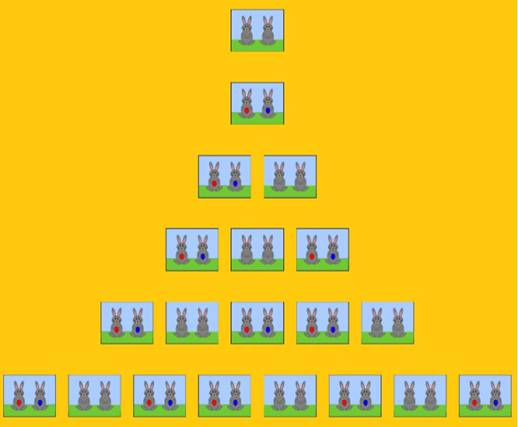
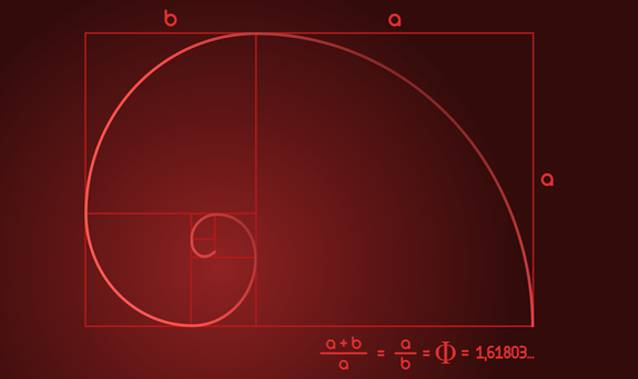
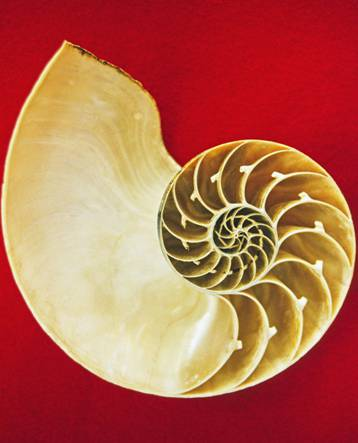
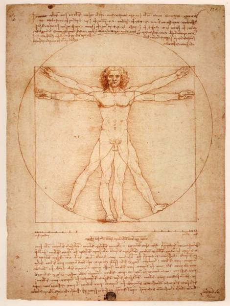

# 🥇 Fibonacci series

## The Fibonacci series, the Phi number and how they manage to describe the universal proportions, which are part of the world around us

Leonardo de Pisa was an Italian mathematician, who has been better known
throughout the world as Fibonacci. This mathematician discovered a sequence
commonly known as "The Fibonacci series"; he came up with this idea when
calculating the number of rabbits that could be obtained over the period of
several months, after inducing them to breed.

Suppose that at the beginning of the first month we have a pair of newborn
rabbits. Therefore, we have one (1) pair of rabbits that will take a month to
develop enough to be able to pair. So at the end of the first month, we can
already cross this pair of rabbits, and we will have 1 + 0 = 1 couples, the same
pair of rabbits, because they have not yet procreated.

Now, at the end of the second month the first couple gives birth to a second
pair of rabbits, and the first pair pairs again, but (of course) they have not
yet sired them and in this case we will already have 1 + 1 = 2, to a couple of
pairs rabbits.

By the end of the third month, the first pair of rabbits gives birth to a third
pair, while the second pair is turning one month old, and they come together to
pair, only that the first pair crosses again. In this case, the first pair
already had two pairs of rabbits. Therefore, the number of rabbit pairs for this
month will be: 2 + 1 = 3

If we follow the succession, at the end of the fourth month, the first pair of
rabbits will have already produced three pairs of rabbits, while the second pair
will already have had their first pair of rabbits. We would then have that the
number of rabbit pairs would be: 3 + 2 = 5.

If we continue doing these calculations, we would have that, if we start with
the numbers 1 and 1 + 0 = 1 and add them both, it would give us the number 2 as
a result, so that:

- 1 + 1 = 2
- 1 + 2 = 3
- 2 + 3 = 5

If we continue adding the last result with the previous one, we can obtain the
rest of the series. So we can continue building the sequence, always with the
sum of the two previous results:

- 5 + 3 = 8
- 8 + 5 = 13
- 13 + 8 = 21 and so on

## How this sequence influences the explanation of certain proportions in nature

This type of mathematical pattern is found in countless examples within nature.
For example, the number of petals a flower has almost always matches a number in
the Fibonacci series. While it is true that some flowers have 3 petals, you will
find others that have 5 petals, while some will have 8 and you can even find
flowers with up to 13 petals. But in very few exceptions, you will find a flower
with a number of petals that does not match a Fibonacci number. That is, with 4,
6, 7, 9, 10 or 11 petals.

The numbers that belong to this series are presented in a big part of the world
that surround us.

In the year 1753 a Scottish mathematician named Robert Simson discovered that
the quotient of two consecutive numbers in the Fibonacci series always tends to
be closer to 1.6180339. The result will always be alternatively, a number
somewhat above and later, another a little below 1.6180339, but yes, without
reaching it absolutely.

The number to which the relationship between two successive numbers of this same
series converges, was called the golden number, which in addition to being
irrational, is denoted by the Greek letter Phi.

If you notice how the seeds that are in the center of any sunflower are
arranged, you will notice that each seed is at a certain angle with respect to
the previous one, which corresponds to approximately 137.5º.

You can obtain this same angle by multiplying the decimals of the Phi number by
360º, and you will obtain an angle greater than 180º. If we take the complement
of this angle, it will give us as a result 137.5º which coincides with what we
call the golden angle.

This allows the seeds to have the optimal filling, that is, the same space
between one seed and another. Resulting in a distribution of seeds from the
center to the periphery and completely covering the area, in the most suitable
way possible. This is how the new leaves that are generated in the sunflower do
not block the sun from the previous leaves and also cover the maximum of the
surface, thus managing to receive as much rain as possible. This same phenomenon
occurs with the leaves of an artichoke.

But, this does not end there, if you count the spirals that form in the center
of a sunflower, you will realize that there are 89 spirals in one direction and
55 in the other; they can also have 144 and 89, where again these three numbers
belong to the illustrious succession.

Trees do not escape this analogy, since if you look closely at the angle that is
formed between two consecutive branches, you will realize that they have an
angle of approximately 137.5º between them.

The succession created by Leonardo de Pisa is also related to the so-called
golden spiral, which is generated by drawing a series of adjacent squares, the
sides of which are made up of the terms of the Fibonacci series. The spiral is
formed by the arcs of circumference, which are formed by the radii of the sides
of these squares.

If we look at the shell of the nautilus (cephalopod mollusk) we can see the
similarity with the golden spiral, only that instead of forming the spiral with
the sides of a square, it is formed with equilateral triangles. Both spirals
differ in the opening, but in both cases they have the same length to generate
the first polygon.

Not satisfied with the similarities described in advance, we can also note that
equivalent spirals are present in certain galaxies and hurricanes.

## The Fibonacci series and the golden ratio in art

Great music composers in the 20th century, such as Olivier Messiaen, Delia
Derbyshire, Béla Bartók, and the band Tool, used this famous succession to
invent new structures for their musical chords.

This Phi number has been directly involved in art for thousands of years. Since
it also interferes with the ideal proportions of certain ancient architectural
structures.

This is because again the Phi number is also obtained when we divide a line into
two certain unequal parts. If we take the quotient of the longest part and the
smallest part, it will end up being equal to the total length of the line
divided by its longest part. That is to say:

a / b = (a + b) / a

Where “a” is the longest part of the line and “b”, the shortest. We can see that
the Pyramid of Giza has a length of 230 meters on each side of its base and its
height is 146 meters. The relationship between the two measures is approximately
1.575, which, as we can see, is quite close to the golden number.

Those numbers can be applied to the proportions of a rectangle, called the
golden rectangle, considered one of the most visually satisfying geometric
shapes.

Even the famous mathematician and sculptor Phidias, born in 500 BC, is believed
to have applied the Phi number to the design of the sculptures in the Parthenon.

On the other hand, a Franciscan friar named Luca Bartolomeo de Pacioli was an
economist, accountant, mathematician and highly recognized for being one of the
forerunners of probability calculus. This friar published a book on mathematics
in 1509 called "De divina proportione", which was illustrated by none other than
Leonardo da Vinci. There he claimed that "Without mathematics there is no art"
and this compendium of writings, only intended to reveal the secret to the
artists about harmonic forms, using the golden ratio as the main tool.

In fact, Leonardo da Vinci himself, through what he called the "sectio aurea",
defined the ideal symmetry in his paintings such as "The Mona Lisa", "The Last
Supper" and "The Vitruvian Man".

Da Vinci claimed that the ideal proportion of a person is closely linked to the
quotient between the measurement of his height and the distance from the ground
to his navel, since for a harmonious human being this relationship tended to
Phi. In the same way, this number was repeated in an approximate way with the
relationship between the distance between his fingers to his shoulder and the
measurement from the elbow to his fingers. In fact, "The Vitruvian Man" was
designed with these proportions.

As if that weren't enough, this sequence has multiple applications in
mathematics, computer science, and even game theory. A mathematical curiosity is
to add ten consecutive numbers chosen at random from the famous series; You will
notice that the result of the sum will always be a multiple of 11. As we can
see, that the Fibonacci series is full of mathematical anecdotes, which can
fascinate anyone who delights in this type of event.
