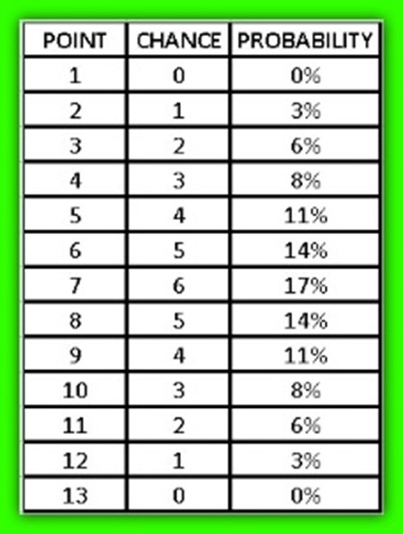
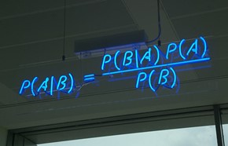

# 🆚 Frequentist versus Bayesian statistics

For the nineteenth century the main entertainment of the members who represented high society, were games of chance. Among them was an expert gambler named Antonie Gombaud, known as the Knight of Meré, and he approached Blais Pascal (a French philosopher and writer born in 1623) to pose two problems that were on his mind, regarding gambling.

Both Pascal and Pierre Fermat were maintaining a great and fluid correspondence around both problems. Thanks to the solutions found by these great characters in history, the foundations were laid on game theory and the calculation of probabilities. From there came a myriad of applications that are used today.

Without knowing it, between the two of them they had created a very powerful tool of interpretation, organization and information for making optimal decisions and from that moment on, the expectations of rolling the dice again have never been the same. Finally, through the beginning of probability, the outcome of the bets could be predicted with a greater degree of accuracy and thus be able to get more out of them.

For example, if we have two dice, one white and one black, what are the probabilities of obtaining the result of the sum of the points of both dice?

As we can see we can obtain a minimum of 2 points, therefore we can never have 1 point or less and we will have a maximum of 12 points, we will never have 13 points.
After counting each and every probability, we can obtain the following distribution table.

Later Thomas Bayes, a Presbyterian minister and English mathematician born in 1702, creates a theorem that bears his name "Bayes Theorem" where he introduces the probability that an event occurs, but taking into account another event that occurred in advance. For example, if, in general, every time we have the flu, we get a headache, we may come to think that if we have a headache, it is likely that we have the flu.

As we can see, it is to understand the probability of obtaining a result, according to the observation of the causes that generated it. This is called "inverse probability", since the direct probability based on classical or frequentist statistics, measures the probability through the frequency with which the expected events occur, based on the amount of results obtained when applying a certain procedure.

The followers of Bayesian analysis affirm that the importance of this tendency lies in drawing general conclusions, but from what has been observed previously and not vice versa. Bayes raises the vision of probability by entering the subjectivity of the observer and how he can change his judgment according to new information or additional evidence that is presented in the way of the investigation.

However, statistics evolved in the most empirical way and based on measurements where subjectivity and intuition were put aside, therefore, the most used statistic throughout the 20th century has been the frequentist. Of course, it became much more established with the appearance of software and computers, where this type of process could be carried out in a more expeditious manner.

As we all know "statistics don't lie", but something was actually missing: For example, suppose that two people want to share a roast chicken, the common thing is to think that each of the diners gets half a chicken; but that does not necessarily imply that both have been satiated, since it may be that each one has not eaten exactly half, it is even probable that one of them has eaten the whole chicken, while the other only dedicates it to observe.

On the other hand, when we talk about the probability of contracting AIDS or cancer, we can understand that population statistics are not very useful to us, since we must take into account not only lifestyle habits, but also genetic parameters. For this reason, it is becoming increasingly evident to use Bayesian analyzes that are adapted to reality.

In fact, this type of statistics has been shown to be much more effective when it comes to dealing with the social sciences and some matters of econometrics, where certain less scientific parameters such as feelings, philosophy and human behavior must be taken into account.

Another advantage that Bayesian statistics offers is that it does not necessarily depend on the size of the sample, although for obvious reasons, the larger this sample, the more accurately we can assess the conclusions we have regarding reality.

The other diatribe posed to frequentists is that their tests focus on affirming or refuting their hypothesis, instead of emphasizing the belief in their hypothesis and the correlation that exists with the empirically analyzed reality. While Bayesians do emphasize precisely the credibility of their hypothesis and are not forced to choose between black and white.

Due to the aforementioned, Bayesian statistics can work in a study where we cannot obtain a large sample, without distorting the results, since not only the previous data are taken into account, but also the new events that are taking place; in addition to the subjectivity of the researchers themselves with respect to how reality can behave according to their analysis.

Giving a much more enriching framework and leaving a greater degree of freedom to the researcher, so that with his knowledge, he can get to assess the probability that the results determined in advance will occur.

However, a hypothesis is required to be able to interpret the results to be obtained and an estimated probability must be established before carrying out the study. Subsequently, the Bayes factor is used, which is nothing more than a measure capable of comparing the data obtained in the investigation, with respect to the proposed hypothesis.

The Bayes factor is applied to the set of probabilities that are established in advance according to the hypothesis, to calculate the highest probability of the data that is expected to be obtained, after the investigation is carried out. It is important to propose the hypothesis that has the highest degree of certainty, in order to verify the data obtained with the greatest possible measure of correctness.

We will then show 3 types of hypotheses to be verified: Association, correlation and mean difference.

We can show that the Bayesian hypothesis is more acceptable than the classical one, based on a study that was done in this regard. For this, the 3 types of hypotheses mentioned above were used and studies were simulated with respect to the contrast between the association, the difference of means and the correlation.

For each of these hypotheses, it is demonstrated how both the Bayes factor and the posterior probability can be interpreted, including how authentic the hypotheses are according to the results obtained in an investigation. Of course, taking into account whether the previous expectations regarding the results obtained after the study are met.

Suppose that we are going to start with a medical investigation, as it happens in any other scientific field, the idea is to compare the different relationships that can be proved, whether causal or not, taking into account the proposed hypothesis. For this, the results of the data that we cannot take as a sample are extrapolated with those data that we do obtain from the participating population.

One of the most frequent examples in this field is to demonstrate whether a drug is more effective than those on the market, either to cure a disease or ailment. In order to verify this hypothesis, empirical data is required from those participants, who have been treated with one of the two options that have been considered in the evaluation.

The evidence will show which of the two drugs is more effective for the treatment in question. But the data obtained can be extrapolated to treat other patients who have not participated in the aforementioned study, this is what we call inference. It is no secret to anyone that no investigation can take into account each and every one of the factors involved and therefore, the predictions of the results cannot be exact. Reasons why, the results should be shown as estimates based on probabilities and using extrapolation, which in turn will depend on the assumptions chosen and the measurements thrown during the study.

Of course, the science that supports the purpose of the research is statistics and from time immemorial, two proposals were established to generate these inferences, which are Bayesian and frequentist statistics.

To establish the difference between both methods, in classical or frequentist statistics, the probability is measured through the frequency with which the expected events occur, based on the number of results obtained when applying a certain procedure.

For example, if we obtain 0.5 as a result, we can conclude that 50% of the time the expected event was obtained. While in Bayesian statistics, the probability has to do with the degree of belief of the result that can be obtained in reality, for example, for the same value of 0.5 it is interpreted as 50% of the certainty that was obtained with respect to something.

## Hypothesis testing

A hypothesis is a presumption about reality and is usually presented as a feasible forecast, that is, based on the theoretical arguments that we have before conducting our research. Now, when we speak of statistical hypotheses, we refer to those that can be verified by mathematical methods, specifically we refer to probabilities.

Although it is true that when conducting both medical and other research, we may find ourselves with the need to contrast more than two hypotheses; It is advisable to consider only two, in order to facilitate the study of a single assumption and not lose ourselves in a compendium of multiple unknowns. In general, a null hypothesis and an alternate hypothesis are established.

When we refer to the null hypothesis, it is to establish a conjecture capable of predicting that there is no difference between the analyzed variables; while the alternate hypothesis does predict a difference between them.

The way to test these hypotheses will depend on the type of statistics that we intend to use. In case of applying the frequentist statistic, only the null hypothesis is checked and for this, random distribution models are developed taking that null hypothesis as true, so that the aforementioned distribution is centered on the null value as its highest probability.

From there comes the value of "p" defined by Fisher, which is responsible for determining the compatibility between the estimated value that can be observed in a study, with the null value.

In other words, "p" is the probability that a previously measured statistical value will be taken as possible, but taking into account a certain null hypothesis.

This value summarizes the probability of seeing a data with its most extreme values and therefore, as the probability of being equated with "p" decreases, the less compatibility it will have with the null value and the variables that influence can be deduced, for that this result is so different from "p".

However, until the contributions of Pearson and Neyman, a limit value had not been established to know if the difference between the values was large enough to deny the hypothesis.

That is why both introduced the PSEHN value, where they established that a null hypothesis can be rejected if “p” is less than the error set at 5%, that is, if p <0.05. This way of establishing a maximum value of "p" helps us to differentiate those sampling results that are a product of chance, from those that are statistically significant.

Although it is true that frequentist statistics has predominated throughout history, in more recent years Bayesian statistics have been taken up again, since many errors have been made when interpreting the value of “p”. They have even inappropriately used the statistical meaning of the null hypothesis, that is, the PSEHN value and that without naming other multiple advantages that Bayesian statistics can offer you.
